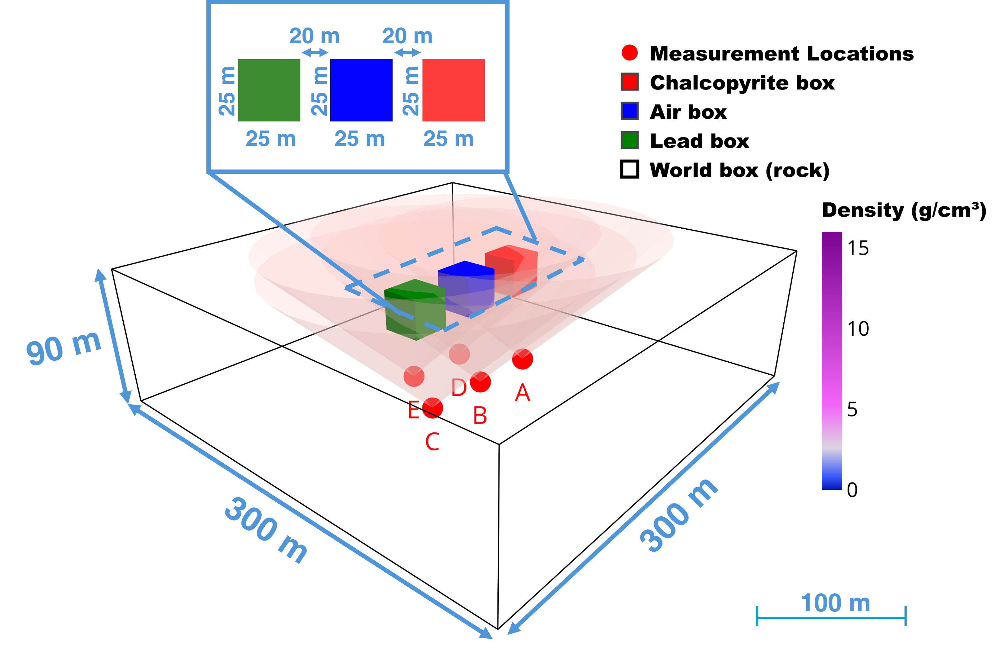

# Musae — User Manual

## 1. Build & Runtime Environment

### 1.1 Dependencies

**Musae-main:**

| Dependency | Minimum Version | Notes |
|---|---|---|
| C++ Compiler | GCC ≥ 13 or Clang ≥ 17 | Required for `std::format` |
| CMake | ≥ 3.21 | |
| MPI | ≥ 3.1 (OpenMPI or MPICH) | `sudo apt install libopenmpi-dev` |
| Eigen | ≥ 3.4.0 | `sudo apt install libeigen3-dev` |
| Geant4 | ≥ 11.0.0 | Must enable GDML: `-DGEANT4_USE_GDML=ON` |
| ROOT | ≥ 6.30.00 | See [ROOT install guide](https://root.cern.ch/install/) |
| Mustard | 0.25.114 (custom) | Automatically downloaded by CMake |

**MuCT (Python notebooks):**
- Python ≥ 3.9
- See `MuCT/requirements_muCT.txt` for the full package list
- Key packages: numpy, scipy, pandas, numba, matplotlib, trimesh, plotly, pyvista, laspy, kaleido, imageio, jupyter

### 1.2 Installing System Dependencies

```bash
# Ubuntu / Debian
sudo apt install build-essential cmake libopenmpi-dev libeigen3-dev \
    libx11-dev libxext-dev libxft-dev libxpm-dev \
    libgl-dev libglu-dev qt6-base-dev qt6-base-dev-tools \
    libxerces-c-dev libexpat1-dev zlib1g-dev libfreetype-dev
```

### 1.3 Installing Geant4

Refer to the [official Geant4 installation guide](https://geant4-userdoc.web.cern.ch/UsersGuides/InstallationGuide/html/) for detailed instructions. A minimal build suitable for Musae:

```bash
# Download Geant4 source
wget https://gitlab.cern.ch/geant4/geant4/-/archive/v11.4.1/geant4-v11.4.1.tar.gz
tar xzf geant4-v11.4.1.tar.gz

# Configure and build (out-of-source)
mkdir -p geant4-v11.4.1-build geant4-v11.4.1-install
cd geant4-v11.4.1-build
cmake -DCMAKE_INSTALL_PREFIX=$PWD/../geant4-v11.4.1-install \
      -DGEANT4_USE_GDML=ON \
      -DGEANT4_USE_QT=ON \
      -DGEANT4_USE_OPENGL_X11=ON \
      -DGEANT4_BUILD_MULTITHREADED=ON \
      ../geant4-v11.4.1
make -j$(nproc)
make install
```

**Important:** `-DGEANT4_USE_GDML=ON` is **required** by Musae. Without it, compilation will fail with `G4GDMLParser.hh: No such file or directory`.

After installation, make CMake aware of Geant4 (choose **one** method):

**Method A — environment variable:**
```bash
export CMAKE_PREFIX_PATH=<geant4-install-dir>:$CMAKE_PREFIX_PATH
# Add to ~/.bashrc for persistence
```

**Method B — CMake argument per build:**
```bash
cmake .. -DGeant4_DIR=<geant4-install-dir>/lib/cmake/Geant4
```

For runtime, Geant4 shared libraries must be findable:
```bash
export LD_LIBRARY_PATH=<geant4-install-dir>/lib:$LD_LIBRARY_PATH
# Add to ~/.bashrc for persistence
```

### 1.4 Installing ROOT

Refer to the [official ROOT installation guide](https://root.cern.ch/install/). Pre-compiled binaries are recommended for most users. Make sure ROOT is discoverable by CMake (`ROOT_DIR` or `CMAKE_PREFIX_PATH`).

### 1.5 Installing a C++20 Compiler

This project requires GCC ≥ 13 or Clang ≥ 17 for `<format>` support. Older versions (e.g., GCC 11–12) set C++20 but lack this header and will fail with `fatal error: format: No such file or directory`.

**Ubuntu 22.04 / Debian 12:**
```bash
sudo apt update
sudo apt install gcc-13 g++-13
export CC=gcc-13 CXX=g++-13
```

**Ubuntu 24.04+ / Debian 13+:**
The default `g++` (≥ 13) works directly — no extra setup needed.

Verify after installation:
```bash
g++ --version   # should show 13.x or newer
```

If using Clang instead:
```bash
sudo apt install clang-17 libc++-17-dev libc++abi-17-dev
export CC=clang-17 CXX=clang++-17
```

### 1.6 Build Instructions

```bash
cd Musae-main
mkdir -p build && cd build
cmake .. -DMUSAE_BUILTIN_MUSTARD=ON -DCMAKE_POLICY_VERSION_MINIMUM=3.5
make -j$(nproc)
```

The built executable `Musae` will be located in `Musae-main/build/`.

### 1.7 Runtime Prerequisites

- All shell scripts in `scripts/` are designed to be run from the `build/` directory.
- **Important:** `Example1.md` and `Example2.md` are **reference guides**, not executable scripts. Open them in any markdown viewer (or `cat`) and copy/run each command individually. SimFlux (Step 2 in both examples) requires manual YAML editing between scenarios and cannot be fully automated.
- Input data paths in YAML and macro (`.mac`) files are relative to the `build/` directory.
- MPI is used for parallel event generation and simulation. Adjust `mpirun -np <N>` if needed.

---

## 2. Musae-main — MuSAE Toolset Overview

MuSAE (Muon Simulation and Analysis Engine) is the core C++/Geant4-based toolkit for cosmic-ray muon simulation and data analysis.

| Module | Function |
|---|---|
| **ReconLGA** | Reconstruct real experimental data from LGA (Large Granularity Array) detector raw files |
| **VisLGA** | Visualize and inspect real experimental LGA data |
| **GenCRMu** | Generate cosmic-ray muon events via EcoMug and store as ROOT files |
| **SimFlux** | Simulate muon transport through a user-defined geometry (described in YAML), producing simulated detector data |
| **AnaOpacity** | Analyze data from ReconLGA or SimFlux; compute survival fractions (opacity) binned by azimuth/zenith angle, and muon minimum-energy vs. mass-thickness distributions; output CSV for MuCT |
| **Projection** | Back-project muons onto a 2D plane and compute standardized residuals; suitable for small-scale scenarios where detector volume is not negligible relative to the density anomaly |

### 2.1 Common Command-line Patterns

All subprograms support `--help` for detailed options:
```bash
./Musae GenCRMu --help
./Musae SimFlux --help
./Musae AnaOpacity --help
./Musae Projection --help
```

---

## 3. MuCT — 3D Density Reconstruction & Visualization

The Python-based reconstruction module performs 3D density inversion from muon opacity data.

### 3.1 Key Notebooks

| Notebook | Purpose |
|---|---|
| `Example2_reconstruct.ipynb` | M-H (Metropolis-Hastings) 3D density inversion using opacity CSV data |
| `Example2_visualize.ipynb` | 3D visualization of reconstruction results with Plotly and PyVista |

### 3.2 Input Data

- Terrain elevation CSV placed in `MuCT/input/Terrain/`
- Opacity CSV output from AnaOpacity placed in `Musae-main/data/Csv_output/`

---

## 4. Example 1 — Concrete Wall Cavity Detection

This example demonstrates muon transmission imaging of a concrete wall with an embedded cubic cavity.

**Workflow:** GenCRMu → SimFlux → AnaOpacity/Projection

### 4.1 Step-by-Step

#### Step 1: Generate Cosmic-Ray Muons (GenCRMu)
```bash
mpirun ./Musae GenCRMu 1000000000 -h 300 -t 0 0 0 -r 3 -p 0 -z 60 \
    -o ../data/GenCRMu/ConcreteWall_test.root -m RECREATE
```
- Generates 1×10⁹ muon events on a hemisphere of radius 3 m at height 300 m.
- `-p 0`: flat momentum spectrum.
- `-z 60`: maximum zenith angle 60°.

#### Step 2: Simulate Muon Transport (SimFlux)

Two scenarios are needed — wall **with** and **without** the cavity — to compute the standard deviation. The macro file (`Example1.mac`) controls the simulation via three key Geant4 UI commands:

| Macro command | Meaning |
|---|---|
| `/Mustard/Detector/Description/Import` | Path to the YAML geometry file |
| `/Mustard/Analysis/FilePath` | Output directory for simulation results |
| `/Mustard/Generator/FromDataPrimaryGenerator/EventData` | GenCRMu input ROOT files + generator type (`CRMu`) |

**Scenario A (with cavity):**
1. Edit `../scripts/Example1.yaml`: ensure the line with `ConcreteWallWithCubeHole0p7_Unit_mm.stl` is active and `ConcreteWall_Unit_mm.stl` is commented out.
2. Edit `../scripts/Example1.mac`: set `/Mustard/Analysis/FilePath` to `../data/SimFlux_vis/ConcreteWall_test`.
3. Run:
   ```bash
   mpirun ./Musae SimFlux ../scripts/Example1.mac
   ```

**Scenario B (without cavity):**
1. Edit `../scripts/Example1.yaml`: comment out the cavity STL and uncomment the solid wall STL.
2. Edit `../scripts/Example1.mac`: set `/Mustard/Analysis/FilePath` to `../data/SimFlux_vis/ConcreteWall_test_noHole`.
3. Run:
   ```bash
   mpirun ./Musae SimFlux ../scripts/Example1.mac
   ```

**Optional pre-check:** Visualize the geometry before running the full simulation:
```bash
./Musae SimFlux -i ../scripts/vis.mac
```

#### Step 3: Analyze Opacity (AnaOpacity)
```bash
./Musae AnaOpacity \
    -i ../data/SimFlux_vis/ConcreteWall_test/*.root \
    -j ../data/SimFlux_vis/ConcreteWall_test_noHole/*.root \
    -h 160 80 1.6 180 0 1 20 \
    -m "RECREATE" \
    -o ../data/Recon_output/ConcreteWall/ConcreteWall_test.root \
    -w -c ../data/Csv_output/ConcreteWall/ConcreteWall_test.csv \
    -s -f ../data/Flux_model/Survival_to_Ecut_table_pmin0.csv
```
- `-h`: binning parameters (azimuth bins, zenith bins, zenith step, ...).
- `-i` / `-j`: target and reference (open-sky) SimFlux data.
- `-c`: output CSV for downstream analysis.
- `-f`: survival-to-energy-range lookup table.

#### Step 4: Back-Projection (Projection)
```bash
./Musae Projection \
    -i ../data/SimFlux_vis/ConcreteWall_test/*.root \
    -j ../data/SimFlux_vis/ConcreteWall_test_noHole/*.root \
    -h 50 30 -5000 5000 -1000 5000 5 -5 0 \
    -m "RECREATE" \
    -o ../data/Recon_output/ConcreteWall/ConcreteWall_test_Projection.root \
    -a 0.712132 -e 90 90 90 -w
```
- `-h`: grid parameters (X bins, Y bins, X range min/max, Y range min/max, smoothing).
- `-a`: detector angular acceptance factor.
- `-e`: Rotation angles of the projection plane (Z-Y-Z Euler angles in degrees).

### 4.2 Key Parameters

| Parameter | Description |
|---|---|
| `-p` (GenCRMu) | Muon momentum. Use 0 for flat spectrum or a formula like `'exp(-5/p-(t/45)^2)'` for a biased spectrum |
| `-z` (GenCRMu) | Maximum zenith angle in degrees |
| `LGA/Position` (YAML) | Detector position(s) in world coordinates (mm) |
| `Model/Path` (YAML) | STL model files for the scene geometry |
| `Material/Path` (YAML) | GDML material definition file |

### 4.3 Euler Angle Convention

When transforming detector-local coordinates to the world coordinate system:
- World frame: Y = north, X = east, Z = up.
- Rotation sequence: intrinsic Z-Y-Z (first around Z, then Y', then Z'').
- Direction: world → detector (right-hand rule = positive).

---

## 5. Example 2 — Multi-Position Terrain Muography & 3D Reconstruction

This example demonstrates muon tomography for 3D density reconstruction. Five MuGrid-v2 detectors (three-layer plastic scintillators, 30×30 cm² cross-section, 89° acceptance cone) are placed inside a 300×300×90 m³ world box filled with rock (2.6 g/cm³). Three 25×25×25 m³ density-anomaly boxes — chalcopyrite (4.2 g/cm³, red), air (1.2×10⁻³ g/cm³, blue), and lead (11.34 g/cm³, green) — are placed 50 m above the detectors, separated by 20 m from each other.



**Workflow:** GenCRMu (×6) → SimFlux (×6) → AnaOpacity (×5) → MuCT

### 5.1 Measurement Geometry

Five detector positions (A–E) are placed across the survey area:

| Position | X (m) | Y (m) | Z (m) |
|---|---|---|---|
| A | −242.5 | 133.5 | −51.51 |
| B | −197.5 | 133.5 | −51.51 |
| C | −152.5 | 133.5 | −51.51 |
| D | −220.0 | 94.5 | −51.51 |
| E | −175.0 | 94.5 | −51.51 |

Each position requires its own GenCRMu and SimFlux run.

### 5.2 Step-by-Step

#### Step 1: Generate Cosmic-Ray Muons (GenCRMu ×6)

Run GenCRMu for each of the five positions plus one open-sky reference (at origin):

```bash
# Position A
mpirun ./Musae GenCRMu 2000000000 -h 300 -t -242.5 133.5 -51.513846 -r 3 \
    -b 'exp(-5/p[GeV/c]-(t[deg]/45)^2)' -p 3 -z 60 \
    -o ../data/GenCRMu/SimBox_A_2e9_p3_z60_b5_r3_2_1.root

# Position B
mpirun ./Musae GenCRMu 2000000000 -h 300 -t -197.5 133.5 -51.513846 -r 3 \
    -b 'exp(-5/p[GeV/c]-(t[deg]/45)^2)' -p 3 -z 60 \
    -o ../data/GenCRMu/SimBox_B_2e9_p3_z60_b5_r3_2_16.root

# Position C
mpirun ./Musae GenCRMu 2000000000 -h 300 -t -152.5 133.5 -51.513846 -r 3 \
    -b 'exp(-5/p[GeV/c]-(t[deg]/45)^2)' -p 3 -z 60 \
    -o ../data/GenCRMu/SimBox_C_2e9_p3_z60_b5_r3_2_16.root

# Position D
mpirun ./Musae GenCRMu 2000000000 -h 300 -t -220 94.5 -51.513846 -r 3 \
    -b 'exp(-5/p[GeV/c]-(t[deg]/45)^2)' -p 3 -z 60 \
    -o ../data/GenCRMu/SimBox_D_2e9_p3_z60_b5_r3_2_16.root

# Position E
mpirun ./Musae GenCRMu 2000000000 -h 300 -t -175 94.5 -51.513846 -r 3 \
    -b 'exp(-5/p[GeV/c]-(t[deg]/45)^2)' -p 3 -z 60 \
    -o ../data/GenCRMu/SimBox_E_2e9_p3_z60_b5_r3_2_16.root

# Open-sky reference (at origin)
mpirun ./Musae GenCRMu 2000000000 -h 300 -t 0 0 0 -r 3 \
    -b 'exp(-5/p[GeV/c]-(t[deg]/45)^2)' -p 3 -z 60 \
    -o ../data/GenCRMu/SimBox_OpenSky_2e9_p3_z60_b5_r3_2_16.root
```

- `-b`: biased momentum-zenith spectrum (energy spectrum ∼exp(−5/p), angular ∼exp(−(θ/45)²)).
- `-p 3`: minimum muon momentum 3 GeV/c.
- 2×10⁹ events per position.

#### Step 2: Simulate Muon Transport (SimFlux ×6)

Six SimFlux runs are required. The macro file (`Example2.mac`) uses three key Geant4 UI commands that must be edited for each run:

| Macro command | Meaning |
|---|---|
| `/Mustard/Detector/Description/Import` | Path to the YAML geometry file (`Example2.yaml` or `Example2_fs.yaml`) |
| `/Mustard/Analysis/FilePath` | Output directory for simulation results (change for each run) |
| `/Mustard/Generator/FromDataPrimaryGenerator/EventData` | GenCRMu input ROOT files + generator type (`CRMu`) |

**For each position A–E:**
1. Edit `Example2.yaml` → `LGA/Position` to the measurement coordinates (unit: mm).
2. Edit `Example2.mac` → `/Mustard/Analysis/FilePath` to e.g. `../data/SimFlux_vis/SimBox_A_2e9_p3_z60_b5_r3_2_1`.
3. Edit `Example2.mac` → `/Mustard/Generator/FromDataPrimaryGenerator/EventData` to the matching GenCRMu output.
4. Run:
   ```bash
   mpirun ./Musae SimFlux ../scripts/Example2.mac
   ```

**For open-sky reference:**
1. Edit `Example2.mac` → `/Mustard/Detector/Description/Import` to `../scripts/Example2_fs.yaml` (flat terrain, air material).
2. Set the output path and GenCRMu path accordingly, then run as above.

Repeat for all 6 configurations.

#### Step 3: Analyze Opacity (AnaOpacity ×5)

Compare each position's data against the open-sky reference:

```bash
# Position A
./Musae AnaOpacity \
    -i ../data/SimFlux_vis/SimBox_A_2e9_p3_z60_b5_r3_2_1/*.root \
    -j ../data/SimFlux_vis/SimBox_OpenSky_2e9_p3_z60_b5_r3_2_16/*.root \
    -h 40 20 1.2 180 0 1 30 -m "RECREATE" \
    -o ../data/Recon_output/SimBox/SimBox_A_2e9_p3_z60_b5_r3_2_13.root \
    -w -c ../data/Csv_output/SimBox/SimBox_A_2e9_p3_z60_b5_r3_2_13.csv \
    -s -f ../data/Flux_model/Survival_to_Ecut_table_pmin3.csv -n 1
```

Repeat for positions B–E, adjusting file names accordingly.

#### Step 4: 3D Density Reconstruction (MuCT)

After generating all five position CSVs from AnaOpacity, prepare the input data:

**Option A — Copy CSV files (recommended):**
```bash
# From Musae-main/build/, copy the CSVs into MuCT:
cp ../data/Csv_output/SimBox/SimBox_A_2e9_p3_z60_b5_r3_2_13.csv ../../MuCT/input/
cp ../data/Csv_output/SimBox/SimBox_B_2e9_p3_z60_b5_r3_2_16.csv ../../MuCT/input/
cp ../data/Csv_output/SimBox/SimBox_C_2e9_p3_z60_b5_r3_2_21.csv ../../MuCT/input/
cp ../data/Csv_output/SimBox/SimBox_D_2e9_p3_z60_b5_r3_2_21.csv ../../MuCT/input/
cp ../data/Csv_output/SimBox/SimBox_E_2e9_p3_z60_b5_r3_2_21.csv ../../MuCT/input/
```

**Option B — Update notebook paths directly:**
In `Example2_reconstruct.ipynb`, modify the `MEASUREMENT_DATA` list to point to the CSV files in `Musae-main/data/Csv_output/SimBox/`.

Then proceed with reconstruction:

1. Open `MuCT/Example2_reconstruct.ipynb` in Jupyter.
2. Set the measurement locations and grid parameters in Cell 2.
3. Ensure the terrain CSV `input/Terrain/SimBox_Nx2_Ny2.csv` is present.
4. Run all cells. The notebook:
   - Loads terrain and builds the voxel grid.
   - Constructs the linear system (path-length matrix) using ray-tracing.
   - Solves it via L-BFGS-B (deterministic) and optionally refines with M-H (Metropolis-Hastings) sampling.
   - Saves the reconstructed density as `.npy` with metadata.

#### Step 5: Visualization

1. Open `MuCT/Example2_visualize.ipynb`.
2. Update `file_path` in Cell 3 to point to the reconstruction output.
3. Run all cells to generate interactive 3D plots of the density field.

## References

- Mustard framework: Geant4-based simulation toolkit
- EcoMug: Cosmic-ray muon generator used by GenCRMu
- GDML: Geometry Description Markup Language for material definitions
